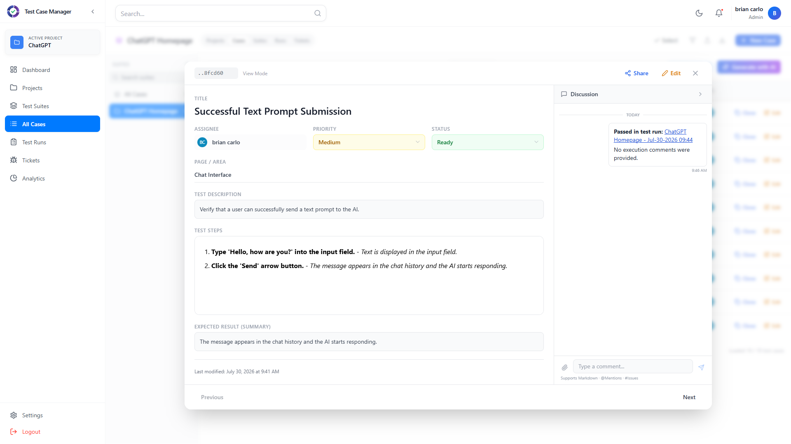
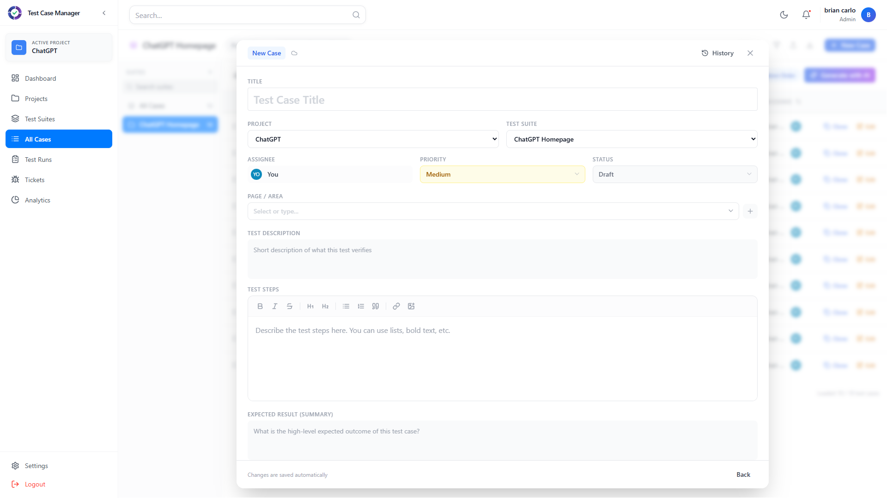
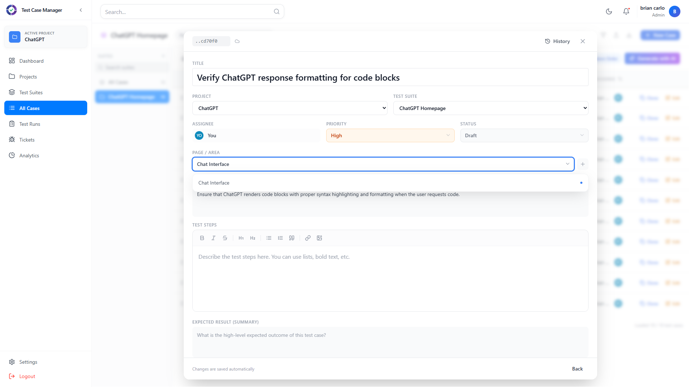
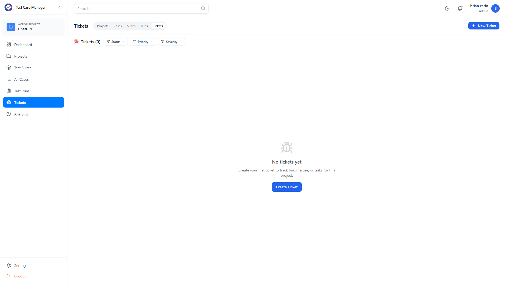
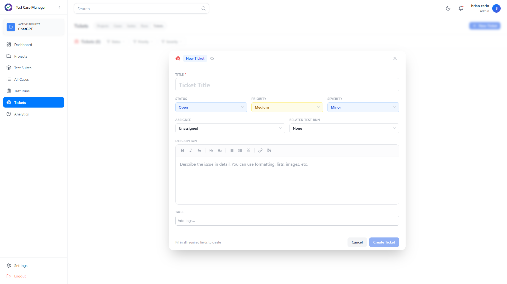
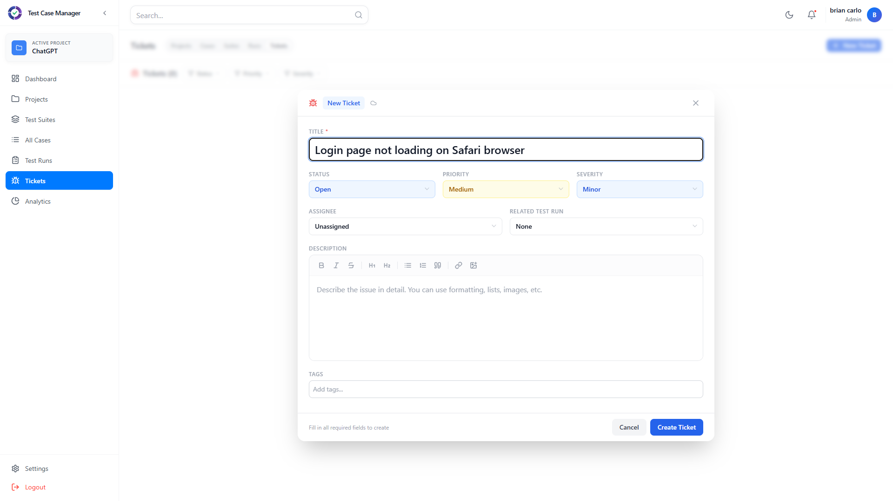
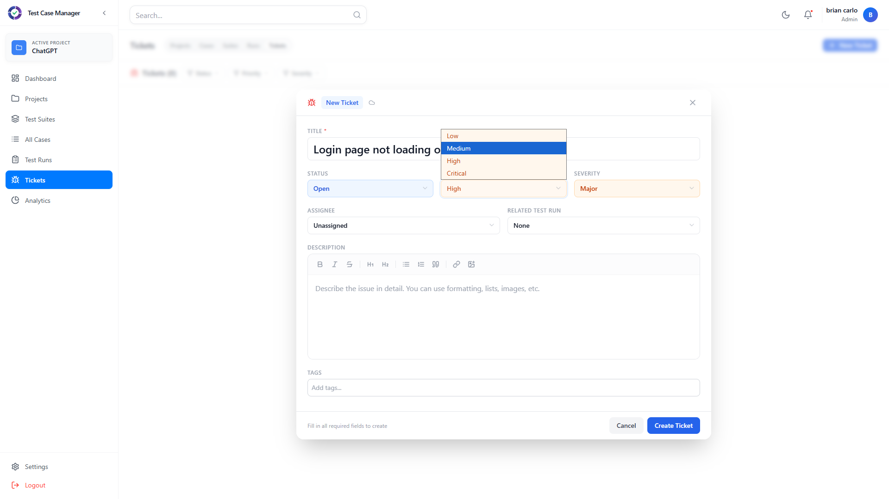

# Screenshots

This page documents the full application end-to-end flow using the **ChatGPT** project and **ChatGPT Homepage** test suite.

## 1. Dashboard

The dashboard provides an overview of total projects, suites, test cases, activity trends, and recent activity.

## 2. Projects

The projects page lists all testing projects. The **ChatGPT** project is selected for this walkthrough.

## 3. Test Suites

Inside the ChatGPT project, the test suites page shows available suites. **ChatGPT Homepage** contains 10 test cases.

## 4. Test Cases (List View)

The test cases page lists all 10 cases within the ChatGPT Homepage suite, with ID, title, priority, status, dates, and assignee.

## 5. Test Case View Modal

Clicking a test case row opens the view modal with full details: title, assignee, priority, status, test description, test steps, expected result, and a discussion panel with execution history.

## 6. New Case Creation Form

Clicking "New Case" opens the creation form with fields for title, project, suite, assignee, priority, status, page/area, test description, test steps, expected result, and comments. Changes are saved automatically.

## 7. Filled Case Creation Form

The filled form with a title, description, priority set to **High**, and page/area specified, demonstrating the complete case creation workflow.

## 8. Tickets (Empty State)

The tickets page for the ChatGPT project initially shows an empty state with a prompt to create the first ticket.

## 9. Create Ticket Form

Clicking "New Ticket" opens a form with fields for title, status, priority, severity, assignee, description, and tags.

## 10. Filled Ticket Form

Entering a ticket title and configuring options.

## 11. Complete Ticket Details

Full ticket details with priority set to **High** and severity set to **Major**.

## 12. Ticket Created

The newly created ticket appears in the tickets list, showing the title, status, priority, severity, and assignee.
